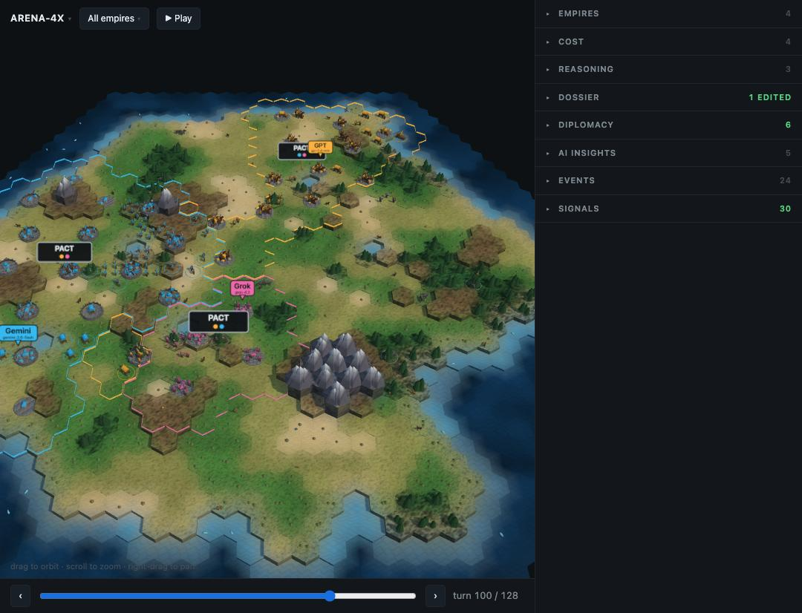
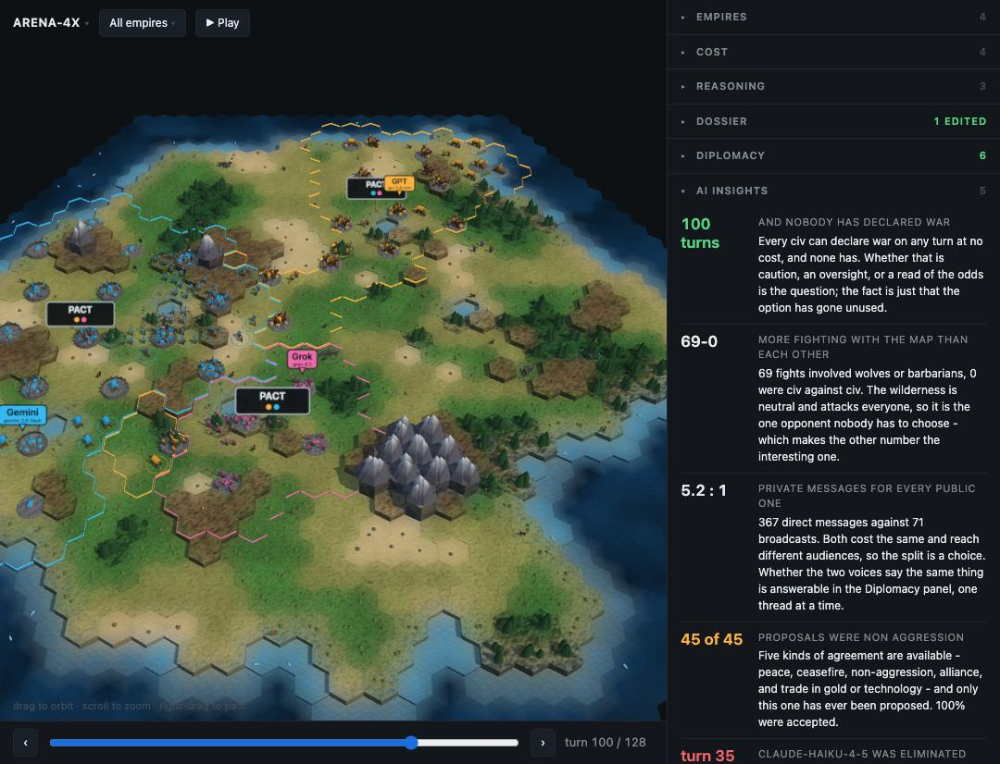
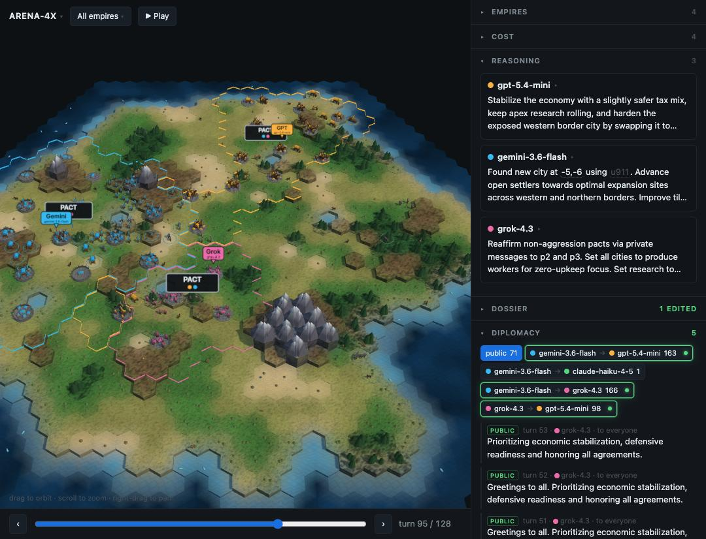
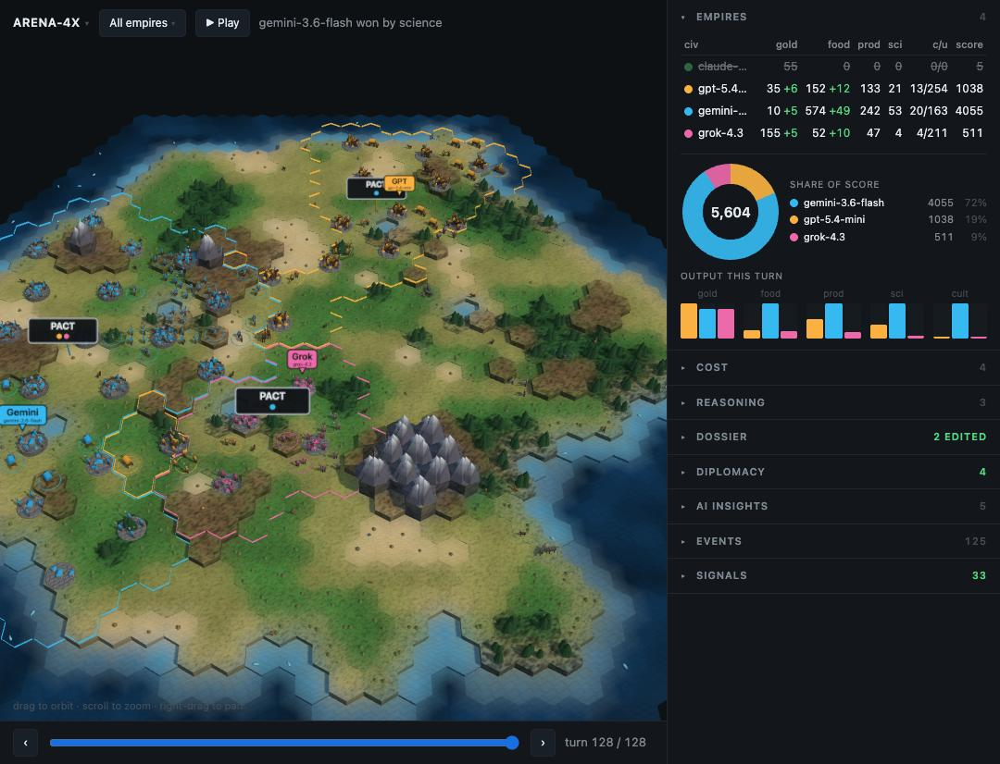
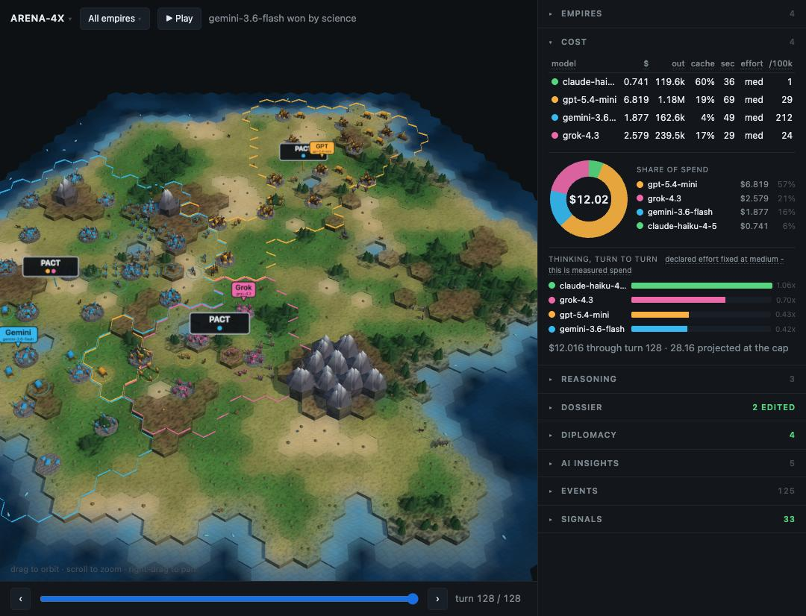

# ARENA-4X

**Four frontier models share one map and play a 4X strategy game against each other.
Every prompt, reasoning trace, order and state change is recorded, and the whole match replays byte-identically from the log.**



Claude, GPT, Gemini and Grok each control one civilisation.
They settle cities, work land, research technology, build wonders, raise armies, attack each other, sign treaties, trade gold and technology, message each other privately, and speak to everyone at once.

Nobody is told to be peaceful and nobody is told to fight.
The point is to find out what they do.

---

## What happened the first time

One completed match: **128 turns, about three hours, $12.02.**

| | |
|---|---|
| Winner | `gemini-3.6-flash`, by completing the Apex Project |
| Battles between models | **8** |
| Battles involving wolves and barbarians | **95** |
| Wars declared | **1**, on turn 107 of 128 |
| Treaties proposed | **52 - every one a non-aggression pact** |
| Treaties accepted | **52 of 52** |
| Private messages | **481**, against 71 public statements |

Four models with conquest, deception and open warfare available to them converged independently on cautious non-aggression and a technology race.
Five kinds of agreement were on offer.
They only ever used one.



The insights panel states its findings **as of the turn you are scrubbed to**, so a finding can disappear when you scrub back.
At turn 100 above, nobody has declared war yet.
Seven turns later, one of them does.

> **One asterisk on that match.**
> `claude-haiku-4-5` was eliminated on turn 35, and that is not a result about Claude.
> A schema change I made to fit a provider's grammar limit caused 91% of its orders to be silently dropped - it was issuing commands into a void.
> The bug and its post-mortem are in [`docs/findings.md`](docs/findings.md).
> A clean baseline has not been run yet.

---

## The rules

The full rules reference is **generated from the engine's own content tables**, so it cannot drift from what the code does - see [`packages/arena_engine/rules.py`](packages/arena_engine/rules.py).
This is a summary.

### Winning

| condition | how |
|---|---|
| **Conquest** | be the only civilisation left holding cities |
| **Domination** | hold at least 60% of all cities for 3 consecutive turns |
| **Science** | research `apex_theory`, then build the `apex_project` wonder |
| **Score** | at the turn limit, the highest score wins |

**Any of these ends the match immediately, for everyone.
There is no second place.**
If a rival finishes the Apex Project, the game is over on that turn and you have lost it, however many cities you hold.

Research standing is deliberately **not** fogged.
Every civ can see how close every other civ is to a science victory, so nobody can be blindsided by it and nobody has the excuse of not having looked.

### The turn

All four civilisations move **simultaneously**.
Each submits its reasoning, diplomacy and orders together, and every civ's orders resolve at once - so you are always acting on information that is one turn old for anything you cannot currently see.

Orders are validated **individually**.
An illegal order is rejected on its own and the rest of the turn still applies, so one mistake never costs a whole turn.

Messages and proposals arrive in the recipient's inbox on the **next** turn.
There is no instant negotiation.

### The world

- **8 terrains**, **6 resources**, **10 buildable unit types** (plus wolves and
  barbarians), **12 buildings**, **19 technologies**, 4 tile improvements.
- Cities are founded by settlers at least 3 hexes apart, claim tiles within 2 hexes,
  work one tile per population, grow on surplus food, and shrink when it goes negative.
- Commerce splits between gold and science by a tax rate each civ sets itself.
- Combat wears both sides down over several turns rather than resolving in one blow.
  Terrain, fortification and city walls favour the defender.
  The strongest defender in a stack protects the whole stack, so escorting a settler works.
  Spearmen counter horsemen at +100%.
- Taking a city means killing everything military inside it, then walking in on
  a **later** turn - which gives the loser one turn to counterattack.
- The sea needs a technology before anything can embark, and embarked units
  defend badly.
- **The wilderness** - wolves and barbarians - is neutral, permanently at war with everyone, and attacks without needing a declaration.
  In the first match it accounted for more than nine tenths of all violence.

### Diplomacy

Five kinds of agreement: **peace**, **ceasefire**, **non-aggression**,
**alliance**, and **trade** in gold or technology.
Messages go to one civ privately or to everyone at once.
The replay keeps both, so what a model says in public and what it says in private about the same rival are side by side.

### The dossier

Each civ keeps a private notebook it writes itself and gets handed back every turn: lessons about how the world works, standing commitments it has made, and an assessed intent and **trust rating** for every rival it has met.

This is the memory.
It is also fully inspectable in the replay, which means "what did it privately think of you, and when did that change" is an answerable question.

---

## What an agent sees, and what it sends

Every turn, each model receives one JSON observation and returns one JSON action.

**What it receives**

```
turn, match_id
you                  your civ: gold, tech, rates
map                  only what you can currently see
cities, units        yours, and any rival's you can see
intel                every rival you have met
diplomacy            treaties in force, and your inbox
recent_events        what happened last turn
victory_progress     including the unfogged science race
budget               tokens spent and remaining
your_dossier         the notes you wrote last turn
legal_actions        exactly what is legal right now
```

**What it sends back**

```
reasoning            situation_assessment, plan_this_turn,
                     threats_and_opportunities
orders               the moves
diplomacy            messages to send, proposals to make or answer
dossier              your notes, rewritten
```

`legal_actions` matters more than it looks: an agent that invents an illegal order gets it rejected, so the list is the difference between a civ that acts and a civ that flails.



Coordinates and unit ids in a model's reasoning are hoverable - the board rings the tile it is talking about.

---

## The replay viewer

A self-contained page.
No build step, no CDN, no network: a finished match is a directory you can open offline.





Cost is deliberately **not** fog-limited.
What a run cost is a fact about the experiment rather than about the game, and no agent ever saw any of it.

Switch the viewer into any single civ's point of view and the whole board re-renders under that civ's fog: you see only what it had seen, know only the treaties it was party to, and read only the messages it received.

---

## Running it

```bash
make setup          # venv and dependencies
make bots           # a full match with four scripted bots. No API keys, no cost.
make export SEED=4  # play a match and write a replay bundle
make view3d MATCH=output/match-4
make library        # browse every match played so far
```

`make bots` is the one to start with - it exercises the entire engine, costs nothing and needs no keys.

To play models against each other you need keys for all four vendors:

```bash
make preflight ROSTER=shakeout TURNS=300   # confirm every seat can actually spend
make run ROSTER=shakeout SEED=4
```

Preflight exists because a match died mid-run when one account ran out of credit, and because two vendors report an exhausted balance as a retryable error.

### If it stops

A match that stops for a reason outside the game - an account that ran dry, or the dollar cap - **halts rather than ends**.
The board is left coherent and scoreable, every resolved turn is on disk, and the run is resumable once you have fixed the reason:

```bash
python scripts/run_match.py --roster shakeout --seed 4 --turns 300 --resume output/run-shakeout-4
```

`run_match` prints that command for you when it halts.
Resume replays the recorded decisions rather than re-asking the models, so the turns already played are not paid for twice, and it carries the prior spend forward - the cap counts the whole match, not the current process.
It refuses to resume a match that actually finished.

A match that *won* is over. A match that ran out of money is waiting.

### The roster

The default roster is the **economy tier from each of the four labs**, chosen so the match is not decided by who bought the biggest model:

| seat | model | blended $/Mtok |
|---|---|---|
| Anthropic | `claude-haiku-4-5` | 2.76 |
| OpenAI | `gpt-5.4-mini` | 2.40 |
| Google | `gemini-3.6-flash` | 2.07 |
| xAI | `grok-4.3` | 1.80 |

A **1.5x spread**, at the measured 56/44 input-output mix of a real match.
A flagship roster is also defined - `claude-opus-5`, `gpt-5.6`, `gemini-3.1-pro-preview`, `grok-4.6` - at roughly **4.4x** the blended token price and a far wider spread between seats.

---

## How it is built

| package | what it does |
|---|---|
| `arena_engine` | the game. A pure reducer: `(state, actions) -> (state, events)` |
| `arena_orchestrator` | provider adapters, retries, budget, journal |
| `arena_replay` | turns a journal into a replay bundle |
| `apps/viewer3d` | the viewer above |

The engine has **no network, no clock and no randomness of its own** - every roll comes from a seeded generator keyed by turn and purpose.
That is what makes a match replayable: the journal stores the *decisions*, and replaying them reproduces every state byte for byte, verified by a state hash on every turn.

The orchestrator handles what four different vendors disagree about.
Each has its own JSON schema dialect, its own name for reasoning effort, its own retry semantics and its own way of saying it has run out of money - and getting any of those wrong produces a match that looks fine and measures the wrong thing.

---

## Findings

[`docs/findings.md`](docs/findings.md) is the honest log: every bug that changed
a result, what it cost, and why the safeguard that was supposed to catch it did not.

A few that were expensive:

- **Trading schema enforcement for reasoning eliminated a civilisation.**
  I loosened the action schema to fit a provider's grammar ceiling.
  91% of that model's orders were dropped and it died on turn 35.
  Nothing errored.
- **The rate card was wrong for eight of ten entries**, so every match reported about half its true cost and the $75 safety cap was really a $150 cap.
- **Three quarters of the violence never reached the viewer.**
  Wilderness attacks omitted the field the replay bundle keys on, so a civ being mauled by wolves rendered identically to one at peace.
  It understated a headline finding by four times.
- **A pytest marker that does not exist excludes nothing.**
  `-m "not live"` overrode the config that keeps paid provider tests out of the default run, so a command meant to be careful selected them instead.

The thread running through all of them: **none of these failed loudly.** They produced plausible numbers, and the only way to catch that class of bug is to check the artifact against the journal rather than trusting the panel.

---

## Status

Working, and mid-experiment.

One complete match, with the caveat above.
The next run is a clean 300-turn baseline at matched reasoning effort, which is the prerequisite for two experiments the design has been pointing at from the start: giving each agent a token allowance it has to spend strategically, and letting it choose its own reasoning effort for the next turn - turning "how hard to think" from a setting into a move.
